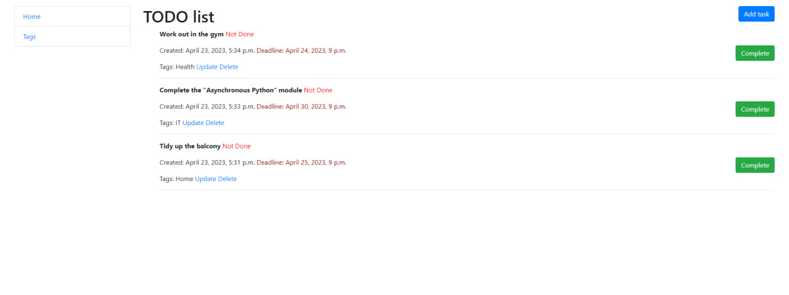

# TODO list

"TODO list" is a web project built on Django that allows users to create tasks, mark them as complete, and delete them when needed.

## Installation 
Python3 must be already installed

```shell
git clone https://github.com/artur-leleiko/to-do-list.git
cd to-do-list
python3 -m venv venv
source venv/bin/activate  # on macOS
venv\Scripts\activate  # on Windows 
pip install -r requirements.txt
python manage.py migrate
python manage.py runserver #starts Django Server
```

## About .env
In the main folder of the project, you will find the .env.sample file, which will contain the SECRET_KEY sample.
You will need to create your own .env file and write down the secret key there as in the example.

## How to use
TODO list is as simple and convenient as possible to use: you do not need to go through the registration process, and you can start working right away.
You have the ability to create tags and tasks with designated deadlines using a user-friendly interface.

## Demo

